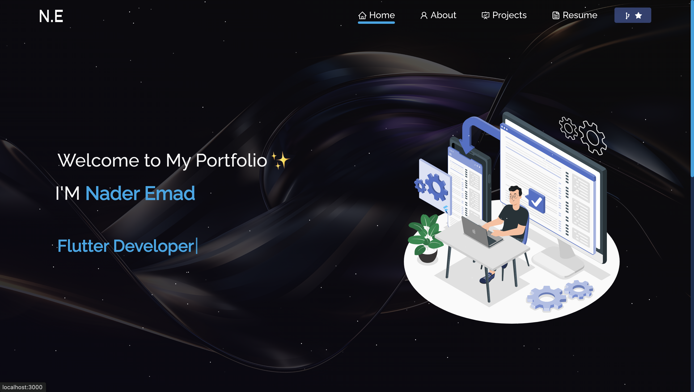

<h2 align="center">
  Portfolio Website - v3.0<br/>
  <a href="https://naderemad9.github.io" target="_blank">naderemad9.github.io</a>
</h2>
<div align="center">
  
</div>

<br/>

<h3 align="center">
    ⚠️
    <a href="https://github.com/NaderEmad9/naderemad9.github.io/issues">Report Bug</a> &nbsp; &nbsp;
    💡
    <a href="https://github.com/NaderEmad9/naderemad9.github.io/issues">Request Feature</a>
</h3>

## TL;DR

You can fork this repo to modify and make changes of your own. Please give me proper credit by linking back to [Nader Emad](https://github.com/NaderEmad9). Thanks!

## Built With

My personal portfolio <a href="https://naderemad9.github.io" target="_blank">naderemad9.github.io</a>, which showcases some of my GitHub projects, my resume, and my technical skills.

This project was built using these technologies:

- [React.js](https://react.dev/)
- [TypeScript](https://www.typescriptlang.org/)
- [Vite](https://vitejs.dev/)
- [Tailwind CSS](https://tailwindcss.com/)
- [shadcn/ui](https://ui.shadcn.com/)
- [React Router](https://reactrouter.com/)
- [Bootstrap](https://getbootstrap.com/) (for some components)
- [VS Code](https://code.visualstudio.com/)

## Features

**📖 Multi-Page Layout**  
**🎨 Styled with Tailwind CSS and shadcn/ui, easy to customize**  
**📱 Fully Responsive**  
**⚡ Fast Vite-based development**  
**🧩 Modular React Components**  
**📝 Resume PDF Viewer and Download**  
**🌙 Dark Mode Ready**  
**📊 GitHub Contribution Calendar**  
**🔗 Social Links and Contact Section**

## Getting Started

Clone this repository. You will need `node.js` and `git` installed globally on your machine.

## 🛠 Installation and Setup Instructions

1. Install dependencies:  
   ```sh
   npm install
   ```
2. Start the development server:  
   ```sh
   npm run dev
   ```
   The app will run at [http://localhost:8080](http://localhost:8080) by default.

## Usage Instructions

- All source code is in the `/src` directory.
- Components are in `/src/components/`.
- Styles are managed with Tailwind CSS (`src/index.css`) and custom CSS (`src/style.css`, `src/App.css`).
- Update your information and content in the relevant components.
- The favicon can be changed by replacing `public/nadicon.ico`.

## Deployment

You can deploy this site on GitHub Pages, Vercel, Netlify, or any static hosting provider.  
To build for production:
```sh
npm run build
```
The output will be in the `dist` folder.

## Show your support

Give a ⭐ if you like this website!

<div align="center">
  <a href="https://buymeacoffee.com/NaderEmad" target="_blank">
    
  </a>
</div>